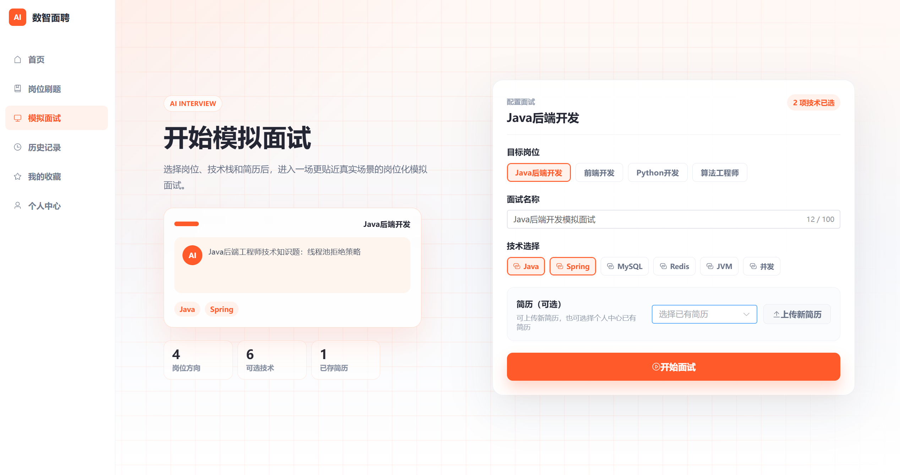
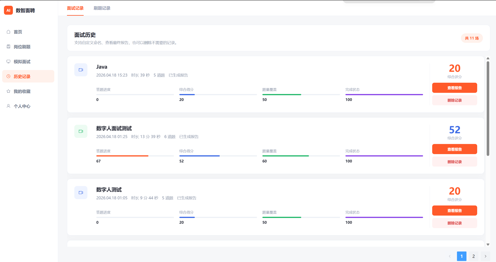

# 数智面聘（Intelliview）

面向计算机专业学生的 AI 模拟面试与成长评估平台。系统以目标岗位和个人简历为上下文，通过 AI 面试官、多轮追问、语音交互与数字人面试，帮助用户完成从模拟训练、报告复盘到能力提升的闭环。

<p align="center">
  
</p>

## 核心能力

- 岗位化面试：围绕 Java、前端、Python、算法、大模型应用等岗位组织面试内容。
- 简历驱动：解析项目经历与技术栈，生成更贴近个人背景的追问。
- AI 模拟面试：支持结构化题目、多轮追问和回答质量评估。
- 语音与数字人：集成语音识别、语音合成和讯飞数字人，增强临场感。
- 多维评估：从技术深度、项目匹配、问题分析、表达清晰和岗位匹配等维度生成报告。
- 成长追踪：沉淀历史训练结果，展示能力趋势并给出专项练习建议。
- 题库与管理端：提供刷题、收藏、练习记录、题目管理和运营数据看板。

## 产品展示

### 创建专属模拟面试



### 沉浸式 AI 面试


### 多维能力分析


### 面试记录与持续成长



## 技术栈

| 层级 | 主要技术 |
| --- | --- |
| 前端 | Vue 3、TypeScript、Vite、Vue Router、Element Plus、ECharts、Axios |
| 后端 | Java 17、Spring Boot 2.7、Spring Security、JWT、MyBatis Plus、WebSocket |
| 数据 | MySQL 8、Redis、Elasticsearch（可选） |
| AI 能力 | 阿里云百炼、通义千问、阿里云语音服务、讯飞数字人 |

## 项目结构

```text
.
├── Intelliview-frontend-web/   # Vue 3 前端（用户端与管理端）
├── Intelliview-backend/        # Spring Boot 后端
├── 项目图片/                   # 产品截图与展示素材
├── data/                       # 题库及文档数据
├── intelliview_szmp.sql        # MySQL 初始化数据
├── .env.example                # 环境变量示例
├── 部署环境变量说明.md         # 完整配置说明
└── 项目介绍.md                 # 项目详细介绍
```

## 本地运行指南

### 1. 环境要求

请先安装以下环境：

- JDK 17
- Maven 3.8+
- Node.js 20+ 与 npm
- MySQL 8.x
- Redis 6+

可用以下命令检查版本：

```bash
java -version
mvn -version
node -v
npm -v
mysql --version
redis-server --version
```

### 2. 获取项目

```bash
git clone git@github.com:lhlucy/shuzhimianpin.git
cd shuzhimianpin
```

也可以使用 HTTPS：

```bash
git clone https://github.com/lhlucy/shuzhimianpin.git
cd shuzhimianpin
```

### 3. 初始化 MySQL

先启动 MySQL，然后创建数据库并导入根目录的初始化脚本：

```sql
CREATE DATABASE intelliview_szmp
  DEFAULT CHARACTER SET utf8mb4
  COLLATE utf8mb4_unicode_ci;
```

```bash
mysql -u root -p intelliview_szmp < intelliview_szmp.sql
```

开发环境当前默认使用 `root / 123456` 连接本机 MySQL。如本机配置不同，请修改 `Intelliview-backend/src/main/resources/application-dev.yml`，或通过启动参数覆盖：

```bash
mvn spring-boot:run -Dspring-boot.run.arguments="--spring.datasource.username=root --spring.datasource.password=你的密码"
```

### 4. 启动 Redis

确保 Redis 监听默认地址 `localhost:6379`：

```bash
redis-server
```

### 5. 启动后端

打开一个终端：

```bash
cd Intelliview-backend
mvn spring-boot:run
```

后端默认运行在 `http://localhost:8080`。

也可以先打包再运行：

```bash
cd Intelliview-backend
mvn clean package
java -jar target/Intelliview-1.0.0.jar
```

### 6. 启动前端

再打开一个终端：

```bash
cd Intelliview-frontend-web
npm install
npm run dev
```

浏览器访问 `http://127.0.0.1:5174`。开发服务器会把 `/api` 请求代理到 `http://localhost:8080`。

### 7. 配置 AI 与第三方能力（可选）

基础页面和常规业务可以先在本地启动；AI 面试、实时语音、邮件验证码、GitHub 登录和数字人功能需要配置对应服务。可参考根目录的 `.env.example` 与 `部署环境变量说明.md`，重点变量包括：

| 变量 | 用途 |
| --- | --- |
| `DASHSCOPE_API_KEY` | 阿里云百炼大模型、语音识别与语音合成 |
| `DASHSCOPE_APP_ID` | 百炼应用 ID |
| `JWT_SECRET` | JWT 签名密钥，生产环境必须使用强随机值 |
| `MAIL_USERNAME` / `MAIL_PASSWORD` | 邮箱验证码服务 |
| `GITHUB_CLIENT_ID` / `GITHUB_CLIENT_SECRET` | GitHub OAuth 登录 |
| `IFLYTEK_AVATAR_*` | 讯飞数字人相关配置 |

`.env.example` 是配置清单，Spring Boot 不会自动读取根目录 `.env` 文件。请在 IDE 的运行配置、终端环境变量或部署平台中注入这些变量。例如 PowerShell：

```powershell
$env:DASHSCOPE_API_KEY="your-api-key"
$env:DASHSCOPE_APP_ID="your-app-id"
$env:JWT_SECRET="replace-with-a-long-random-secret"
cd Intelliview-backend
mvn spring-boot:run
```

不要把真实密钥提交到 Git。

## 构建

前端生产构建：

```bash
cd Intelliview-frontend-web
npm ci
npm run build
```

构建产物位于 `Intelliview-frontend-web/dist/`，可使用 Nginx 等静态 Web 服务器托管。

后端生产构建：

```bash
cd Intelliview-backend
mvn clean package -DskipTests
```

构建产物位于 `Intelliview-backend/target/`。生产运行时建议启用 `prod` 配置并通过环境变量注入数据库、Redis 和第三方服务参数：

```bash
java -jar target/Intelliview-1.0.0.jar --spring.profiles.active=prod
```

## 常见问题

### 前端能打开，但接口请求失败

确认后端已在 `8080` 端口运行。若前后端地址有变化，请设置前端变量 `VITE_API_BASE_URL`，或调整 `vite.config.ts` 中的代理地址。

### 后端提示数据库连接失败

确认 MySQL 已启动、`intelliview_szmp` 已创建并导入 SQL，同时检查开发配置中的用户名和密码。

### 后端提示 Redis 连接失败

确认 Redis 已启动并监听 `localhost:6379`；使用非默认地址或密码时需要同步修改后端配置。

### AI 面试或语音功能不可用

确认已配置有效的 `DASHSCOPE_API_KEY`，并检查对应模型、应用与语音服务是否已在阿里云控制台开通。

## 更多文档

- [项目详细介绍](项目介绍.md)
- [部署环境变量说明](部署环境变量说明.md)
- [隐私说明](隐私说明.md)
- [后端 API 文档](Intelliview-backend/doc/API文档.md)

## License

本项目使用 [Apache License 2.0](LICENSE)。
